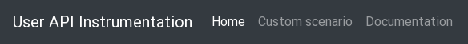
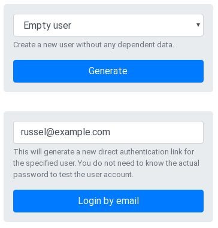

[](https://travis-ci.com/hausgold/factory_bot_instrumentation)
[](https://badge.fury.io/rb/factory_bot_instrumentation)
[](https://codeclimate.com/repos/5c35e98c8e9b03333000021e/maintainability)
[](https://codeclimate.com/repos/5c35e98c8e9b03333000021e/test_coverage)
[](https://www.rubydoc.info/gems/factory_bot_instrumentation)

This project is dedicated to provide an API and frontend to
[factory_bot](https://github.com/thoughtbot/factory_bot) factories to generate
test data on demand. With the help of this gem your testers are able to
interact easily with the entities of your application by using predefined use
cases.

- [Installation](#installation)
- [Getting started](#getting-started)
- [Usage](#usage)
  - [Configuration](#configuration)
    - [Instrumentation](#instrumentation)
    - [Routes](#routes)
    - [Authentication](#authentication)
    - [Global settings](#global-settings)
  - [API](#api)
    - [Request](#request)
    - [CORS](#cors)
    - [Response](#response)
    - [Hot reloading](#hot-reloading)
  - [Frontend](#frontend)
    - [Custom hooks](#custom-hooks)
      - [preCreate](#precreate)
      - [postCreate](#postcreate)
      - [preCreateResult](#precreateresult)
      - [postCreateResult](#postcreateresult)
      - [preCreateError](#precreateerror)
      - [postCreateError](#postcreateerror)
    - [Navigation](#navigation)
    - [Additional blocks](#additional-blocks)
    - [Custom scripts](#custom-scripts)
    - [Custom styles](#custom-styles)
- [Development](#development)
- [Contributing](#contributing)

## Installation

Add this line to your application's Gemfile:

```ruby
gem 'factory_bot_instrumentation'
```

And then execute:

```bash
$ bundle
```

Or install it yourself as:

```bash
$ gem install factory_bot_instrumentation
```

## Getting started

Say you have a complex application with lots of factories which are
interconnected and you want to test some fixed scenarios from another
application test suite (eg. end-to-end testing). Then you need to prepare some
seeds on each involved application before the test suite starts. Now your test
suite deletes some entities inside a regular test to verify the frontend
application is working as expected. Whoop. A failure happens on the frontend
and a lot of tests fail due to the root cause that an entity was not
deleted/recreated.

A better solution whould be a dynamic seed generation per test case. So an
entity may be deleted in an isolated manner, due to a random seed. Thats even
better than looking for a statically seeded entity on a list for example,
because you can now just focus on the single entry which was dynamically
generated for your insolated test case.

Another use case for dynamic seeds are explorative testers. They could benefit
from the entities your factories are already generating. But on canary, or
production like environments they are not able to access an Rails console to
trigger the factory_bot factories. Thats where `factory_bot_instrumentation`
comes in.

## Usage

Lets start with a common factory_bot factory. Say your application handles user
accounts and a single user may have multiple friends with a self reference.
(the association does not matter) Than the factory could look like this:

```ruby
FactoryBot.define do
  factory :user do
    first_name { FFaker::NameDE.first_name }
    last_name { FFaker::NameDE.last_name }

    transient do
      friend_traits { [] }
      friend_overwrites { {} }
      friends_amount { 2 }
    end

    trait :confirmed do
      after(:create, &:confirm!)
    end

    trait :with_friend do
      after(:create) do |user, elevator|
        FactoryBot.create(:lead,
                           *elevator.lead_traits.map(&:to_sym),
                           friends: [user],
                           **elevator.friend_overwrites)
      end
    end

    trait :with_friends do
      after(:create) do |user, elevator|
        FactoryBot.create_list(:user,
                                elevator.leads_amount,
                                *elevator.lead_traits.map(&:to_sym),
                                friends: [user],
                                **elevator.friend_overwrites)
      end
    end
  end
end
```

At your specs you would use it somehow like this:

```ruby
let(:user) { create :user }
let(:user_with_single_friend) { create :user, :with_friend }
let(:user_with_single_friend_bob) do
  create :user,
         :with_friend,
         friend_overwrites: { first_name: 'Bob' }
end
let(:user_with_many_friends) { create :user, :with_friends, friends_amount: 5 }
```

With the Instrumentation engine you allow external users to trigger your
factories the same way via an API (HTTP request) or with preconfigured
scenarios via an easy to use frontend. Thats it.

### Configuration

#### Instrumentation

The Instrumentation engine works with preconfigured scenarios on the frontend
as well as adhoc requests via the API. By default it requires a
`config/instrumentation.yml` inside your application where all scenarios are
defined. You can use the following example as a starting point to your
configuration.

```yaml
# Define new dynamic seed scenarios here which can be used on the API
# instrumentation frontend.

default: &default
  # Each group consists of a key (the pattern to match) and the value (group
  # name).  The patterns are put inside a quoted regex and the first matching
  # one will be used so the configuration order is important.
  groups:
    UX: UX Scenarios
    user: Users

  # All the scenarios which can be generated.
  scenarios:
    - name: Empty user
      desc: Create a new user without any dependent data.
      factory: :user
      traits:
        - :confirmed
      overwrite: {}

    - name: User with a single friend
      desc: Create a new user with a single friend.
      factory: :user
      traits:
        - :confirmed
        - :with_friend
      overwrite: {}

    - name: User with a single friend named Bob
      desc: Create a new user with a single friend whoes name is Bob.
      factory: :user
      traits:
        - :confirmed
        - :with_friend
      overwrite:
        friend_overwrites:
          first_name: Bob

    - name: User with multiple friends
      desc: Create a new user with 5 friends.
      factory: :user
      traits:
        - :confirmed
        - :with_friends
      overwrite:
        friends_amount: 5

test:
  <<: *default

development:
  <<: *default

production:
  <<: *default
```

#### Routes

You can mount the Instrumentation engine (API and frontend) easily into your
Rails application the following way:

```ruby
Rails.application.routes.draw do
  mount FactoryBot::Instrumentation::Engine => '/instrumentation'
end
```

In cases you want to enhance the functionality under the same namespace, you
could mount the Instrumentation engine like this:

```ruby
Rails.application.routes.draw do
  namespace :instrumentation do
    mount FactoryBot::Instrumentation::Engine => '/'
    resource :authentication, only: :create
  end
end
```

The `Instrumentation::Authentication` controller must be implemented by your
application. The file
`app/controllers/instrumentation/authentications_controller.rb` could look like
this:

```ruby
class Instrumentation::AuthenticationsController < ActionController::API
  # Generate a new web app authentication URL for the given email address.
  # This endpoint creates new login URLs which are valid for 30 minutes.
  def create
    render json: { url: url }
  end

  private

  def url
    User.find_by(email: params.permit(:email).fetch(:email)).auth_url
  end
end
```

#### Authentication

By default the Instrumentation engine comes without authentication at all to
ease the integration. But as you can imagine the Instrumentation engine opens
up some risky possibilities to your application. This is fine for a canary or
development environment, but not for a production environment.

There is currently only one way to secure the Instrumentation engine. You can
completly disable it on your production environment by reconfiguring your
routes like this:

```ruby
Rails.application.routes.draw do
  unless Rails.env.production?
    mount FactoryBot::Instrumentation::Engine => '/instrumentation'
  end
end
```

Another option would be an HTTP basic authentication on this routes, but this
is not yet implemented.

#### Global settings

Beside the configurations from above comes some gem settings you can tweak. The
best place for this would be an initializer at your Rails application. (eg.
`config/initializers/factory_bot_instrumentation.rb`) Here comes an example
with inline documentation of the settings.

```ruby
FactoryBot::Instrumentation.configure do |conf|
  # You can set a fixed application name here,
  # defaults to your Rails application name in a titlized version
  conf.application_name = 'User API'
  # The instrumentation configuration file path we should use,
  # defaults to config/instrumentation.yml
  conf.config_file = 'config/scenarios.yml'
end
```

### API

The Instrumentation engine comes with a single API endpoint which allows you to
trigger your factory_bot factories with traits and overwrites. Thats just as
simple as it sounds.

The endpoint is at the same path as you mounted the engine. Say you mounted the
engine at `/instrumentation`, then you can send an `POST` request to this path.

#### Request

A sample request body looks like this:

```json
{
  "factory": "user",
  "traits": ["confirmed"],
  "overwrite": {
    "first_name": "Bernd",
    "last_name": "Müller",
    "email": "bernd.mueller@example.com",
    "password": "secret"
  }
}
```

When sending requests to this endpoint make sure to send the correct
accept/content-type headers. (`Accept: application/json`, `Content-Type:
application/json`)

#### CORS

In case you want to deal with this endpoint from a different frontend
application via XHR calls (AJAX) you need to set the CORS headers for your
application. See [rack-cors](https://github.com/cyu/rack-cors) - and the
following naive example:

```ruby
Rails.application.config.middleware.insert_before 0, Rack::Cors do
  allow do
    origins '*'
    resource '*',
             headers: :any,
             methods: %i[get post put patch delete options head]
  end
end
```

#### Response

The response of this endpoint is always the generated entity as JSON
representation. (Just like this: `FactoryBot.create(:user).to_json`)

#### Hot reloading

As you configure your scenarios and enhance your factory_bot factories you
don't have to reboot your application to get the new configuration read or the
factory code reloaded manually. Each time you reload the Instrumentation
frontend on your browser, the configuration file is reread. The same is true
for API requests - the factories are reloaded before each request.

### Frontend

* [Regular Instrumentation Frontend](doc/assets/regular.png)
* [Fully customized Instrumentation Frontend](doc/assets/customized.png)

#### Custom hooks

You can define some custom hooks to enhance the functionality. With the help
of the following hooks you are able to customize the outputs, perform
additional HTTP requests or anything you like.

All the hooks are designed to passthrough a payload. They receive this
payload as the first argument, and a callback function to signal the end of
the hook. You MUST pass the payload as second parameter to the callback, or
pass an error object as first argument. You can modify the payload as you
wish, eg. adding some data from subsequent requests.

Example hooks:

```javascript
// Error case
window.hooks.postCreate.push((payload, cb) => {
  cb({ error: true});
});

// Happy case
window.hooks.postCreate.push((payload, cb) => {
  cb(null, Object.assign(payload, { additional: { data: true } }));
});
```

Mind the fact that you can define multiple custom functions per hook type.
They are executed after each other in a waterfall like flow. The order of
the hooks array is therefore essential.

The best place to put your custom hooks is the `_scripts.html.erb` partial. See
the [Custom scripts](#custom-scripts) section below. Here comes a sample:

```html
<script>
  window.hooks.postCreate.push((payload, cb) => {
    // Perform your request
    window.utils.request({
      data: JSON.stringify({ email: payload.email }),
      url: '<%= main_app.instrumentation_authentication_path %>',
    }, (err, result) => {
      if (err) { return cb(err); }
      if (!result.url) { return cb(data); }
      cb(null, Object.assign(payload, { auth: result }));
    });
  });

  window.hooks.preCreateResult.push((options, cb) => {
    // Append some text to the alert message
    options.alert += ` Some additional alert content.`;
    // Or just overwrite the whole alert content
    options.alert = 'Special alert!';
    // Create a custom card and add it to the accordion
    options.cards.push(window.utils.card({
      id: 'auth',
      icon: 'fa-key',
      title: 'Authentication',
      body: `
        <pre id="auth-data">${options.payload.auth}</pre>
        ${window.utils.clipboardButton('auth-data')}
      `
    }));
    // Don't forget to call the callback function
    cb(null, options);
  });
</script>
```

To access your named application routes, you have to use the `main_app` helper.
So a regular `<%= root_path %>` becomes `<%= main_app.root_path %>` while
adding some custom scripts/styles/blocks.

##### preCreate

With the help of the `perCreate` hooks you can manipulate the create
request parameters. Think of an additional handling which reads an
overwrite form or a kind of trait checkboxes to customize the factory
call. The `payload` looks like this:

```javascript
{
  factory: 'user',
  traits: ['confirmed'],
  overwrite: { password: 'secret' }
}
```

##### postCreate

The `postCreate` hook allows you to perform subsequent requests to fetch
additional data. Think of a user instrumentation where you want to request
a one time token for this user. This token can be added to the payload and
can be shown with the help of the `preCreateResult` hook. The payload
contains the request parameters and the response body from the
instrumentation request. Here comes an example `payload`:

```javascript
{
  request: { factory: 'user', /* [..] */ },
  response: { /* [..] */ }
}
```

##### preCreateResult

With the help of the `preCreateResult` hook you can customize the output
of the result. You could also perform some subsequent requests or some UI
preparations. You can access the output options and the runtime payload
with all its data and make modifications to them. This hook is triggered
before the result is rendered. A sample payload comes here:

```javascript
{
  alert: 'Your alert text.',
  output: 'Formatted response',
  payload: { request: { /* [..] */ }, response: { /* [..] */ } },
  cards: [
    `The details accordion card,
     you can add more, remove the details card
     or reorder them`
  ],
  openCard: '#details', // Open a custom card, or none
  pre: 'Additinal HTML content before the alert.',
  post: 'Additinal HTML content after the formatted response output.'
}
```

##### postCreateResult

In case you want to perform some logic after the result is rendered, you
can use the `postCreateResult` hook. You can access the output options and
the runtime payload with all its data, but changes to them won't take
effect. The `payload` looks like this:

```javascript
{
  alert: 'Your alert text.',
  output: 'Formatted response',
  payload: { request: { /* [..] */ }, response: { /* [..] */ } },
  cards: [
    `The details accordion card,
     you can add more, remove the details card
     or reorder them`
  ],
  openCard: '#details', // Open a custom card, or none
  pre: 'Additinal HTML content before the alert.',
  post: 'Additinal HTML content after the formatted response output.'
}
```

##### preCreateError

With the help of the `preCreateError` hook you can customize the output of
the error. Furthermore you can perform some subsequent requests or
whatever comes to your mind. You can access the output options and the
runtime payload with all its data and make modifications to them. This
hook is triggered before the error is rendered. A sample payload comes
here:

```javascript
{
  alert: 'Your alert text.',
  output: 'Formatted response',
  payload: { request: { /* [..] */ }, response: { /* [..] */ } },
  pre: 'Additinal HTML content before the alert.',
  post: 'Additinal HTML content after the formatted response output.'
}
```

##### postCreateError

In case you want to perform some magic after an error occured, you can use
the `postCreateError` hook. You can access the output options and the
runtime payload with all its data, but changes to them won't take effect
because this hook is triggered after the error is rendered. The `payload`
looks like this:

```javascript
{
  alert: 'Your alert text.',
  output: 'Formatted response',
  payload: { request: { /* [..] */ }, response: { /* [..] */ } },
  pre: 'Additinal HTML content before the alert.',
  post: 'Additinal HTML content after the formatted response output.'
}
```

#### Navigation



You can customize the navigation of the Instrumentation frontend by creating
the `app/views/factory_bot_instrumentation/_navigation.html.erb` inside your
application. This could be useful to create additional links to documentations
(or maybe an inline documentation page), some custom instrumentation actions,
etc. Here comes a sample `_navigation.html.erb`:

```html
<li class="nav-item active">
  <a class="nav-link" href="#">Home</span></a>
</li>
<li class="nav-item">
  <a class="nav-link" href="#">Link</a>
</li>
```

#### Additional blocks



In some cases you want to add additional functionality to the Instrumentation
frontend like the feature to login random users, or trigger special behaviour
of your application. This is done by custom blocks which provide an easy way to
enhance the frontend. Just create a new
`app/views/factory_bot_instrumentation/_blocks.html.erb` inside your
application. In case you have multiple custom blocks it comes in handy to split
each block into its own partial. Therefore you could create a subdirectory like
`app/views/factory_bot_instrumentation/blocks/` and place a `_example.html.erb`
file into it. The `_blocks.html.erb` can than include the partials this way:

```html
<%= render partial: 'factory_bot_instrumentation/blocks/example' %>
```

An example block could look like this:

```html
<form id="authenticate-email" class="jumbotron">
  <div class="form-group">
    <input type="email" class="form-control email"
           placeholder="Enter email">
    <small id="help" class="form-text text-muted">
      This will generate a new direct authentication link for the
      specified user. You do not need to know the actual password to
      test the user account.
    </small>
  </div>
  <button id="login" type="submit" class="btn btn-primary btn-block">
    Login by email
  </button>
</form>
<script>
  $(() => {
    const scope = '#authenticate-email';
    const form = new Form(scope);

    form.email = $(`${scope} .email`);

    form.bind((event) => {
      async.waterfall([
        Utils.pushWaterfallPayload({ email: form.email.val() }),
        (payload, cb) => {
          // Perform your request (See: utils for a request helper)
        }
      ], (err, result) => {
        if (err) { return form.showError(err, err.responseText || err); }
        form.showResult(result, result.response);
      });
    });

    form.errorContent = function(payload, output, cb)
    {
      cb(null, `
        <div class="alert alert-danger" role="alert">
          An unexpected error occured.
        </div>
        <pre id="data">${output}</pre>
        ${window.utils.clipboardButton('data')}
      `);
    };

    form.resultContent = function(payload, output, cb)
    {
      let alertPayload = {
        email: payload.email,
        url: payload.response.url
      };
      cb(null, `
        <div class="alert alert-success" role="alert">
          <a href="${payload.response.url}">Login now</a> to a
          ${payload.email} session.
        </div>
        <pre id="data">${output}</pre>
        ${window.utils.clipboardButton('data')}
      `);
    };
  });
</script>
```

#### Custom scripts

You can also include some custom scripts which could load additional libraries,
or add some custom library code. Just create a
`app/views/factory_bot_instrumentation/_scripts.html.erb` inside your
application. And fill in your content. Example file:

```html
<script>
  window.lib = Lib = {};
  Lib.alert = () => alert('This is a test.');
</script>
```

See
[utils.js](app/assets/javascripts/factory_bot_instrumentation/lib/utils.js),
and [form.js](app/assets/javascripts/factory_bot_instrumentation/lib/form.js)
for some helpers you can use at your custom hooks or custom scripts.

#### Custom styles

Next to scripts you can place some custom styles. This can be very helpful for
custom functionality like blocks or complete custom Instrumentation pages. Just
create `app/views/factory_bot_instrumentation/_styles.html.erb` inside your
application. The file could look like this:

```hmtl
<link rel="stylesheet"
      href="https://cdnjs.cloudflare.com/ajax/libs/highlight.js/9.12.0/styles/dark.min.css"
      integrity="sha256-GVo4WKmO61/tVmRyEKLvRm2Nnq7mdFCaOim/9HbNpaM="
      crossorigin="anonymous" />
<style>
  pre {
    margin-bottom: 0;
    white-space: pre-wrap;
    white-space: -moz-pre-wrap;
    white-space: -pre-wrap;
    white-space: -o-pre-wrap;
    word-wrap: break-word;
  }
</style>
```

## Development

After checking out the repo, run `bin/setup` to install dependencies. Then, run
`bundle exec rake spec` to run the tests. You can also run `bin/console` for an
interactive prompt that will allow you to experiment.

To install this gem onto your local machine, run `bundle exec rake install`. To
release a new version, update the version number in `version.rb`, and then run
`bundle exec rake release`, which will create a git tag for the version, push
git commits and tags, and push the `.gem` file to
[rubygems.org](https://rubygems.org).

## Contributing

Bug reports and pull requests are welcome on GitHub at
https://github.com/hausgold/factory_bot_instrumentation.
